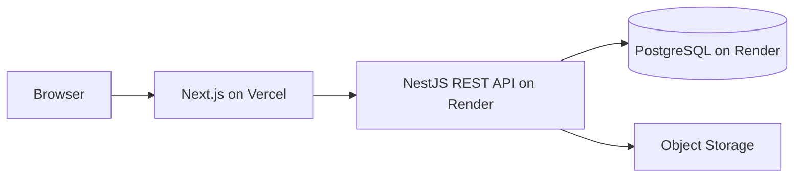

# System Architecture

Frontend trình bày và gọi REST `/api/v1`; API xác thực, áp dụng business rules và truy cập PostgreSQL/storage. Trust boundaries nằm giữa browser–API, API–database và API–storage. Failure cần timeout, retry có kiểm soát, error response chuẩn và degraded UI. Scale bằng frontend stateless, API stateless, indexes/caching phù hợp; Render cold start và upload lớn là ràng buộc cần theo dõi.
