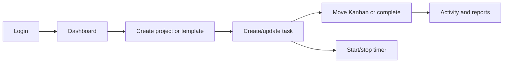

# User Flows

Login xác thực rồi mở Dashboard. Tạo project có thể bắt đầu từ template; tạo/update task gồm subtask và checklist. Kanban đổi status/thứ tự; complete ghi thời điểm. Timer start/stop hoặc manual entry. My Tasks/Calendar/Search lọc dữ liệu; Archive có restore; Reports tổng hợp thời gian và tiến độ. Delivery flow: plan → execute → test → deploy → handover → archive/maintenance.
